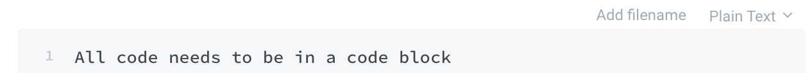

# Doc Formatting Guide

## Fonts and Headings

## Heading 1 - Use this for main headings

### Heading 2 - Use this for subheadings

#### Heading 3 - Use this for any deeper heading needs, points of emphasis, example titles, and short definitions

Paragraph text - Use this for... well... paragraphs

One important note here is that Heading 1 and Heading 2 will structure your document's right side navigation, so make sure these are used correctly.

All headings also have anchors you can use to help users navigate the documentation.

## Code Blocks and Handling Examples

### Code Block

```text
All code needs to be in a code block
regardless of how small/inconsequential it may seem.
This creates continuity and lets the reader know
what they're looking at prior to actually reading.
```

Please make sure to pick a file type in the upper right corner when editing the code block so that everything remains very explicit for the reader. 

Also, don't use the 'Add filename' button to add more code blocks that are dependent on each other \(ie. examples that require yaml and data service changes\). Those will be handled a little bit differently, which you'll see in the next section. 



### Handling Examples

When dealing with inserting examples into the documentation where you need more than one code block, use the 'Tabs' option, have one tab for each file you'll be referencing, and then add a single code block to each tab w/ that piece of the example.

Try to remember to follow smart naming conventions for tab names. At the very least, they should end with '.filetype'.

#### Doc Example Title



```python
Here be yer python code
```



```yaml
Here be yer yaml code
```



```markup
Here be yer HTML code
```



## Hints

### The Success


Use me if you want to make sure someone knows that they need to do something to be successful, or if they should see something if they are successful. Use it with things like the setup, the tutorial, or anything where they might need to see a certain return in the terminal or something.


### The Warning


Use me if you want to make sure someone knows that they need to watch out for various possibilities and outcomes that could mean they're off track, or to note common pitfalls, abnormalities, or common misconceptions. Also useful to reiterate a point made in the docs previously or subsequently. 


### The Red Dawn Alert


Similar to The Warning, use me when something can go wrong. This should be reserved for potentially app altering events and things that can set the user back if not done correctly.


### The Other Guy


Use me if you want to tell the user something important and it doesn't fit into any category above.


## Images

Include images as frequently as possible. If you can take a screenshot of an example, do it. 

Your pictures should be captioned if possible, and they should be center aligned \(which is the default\)


## Lists

### Bulleted Lists

You can create a bulleted list to use when you need people to know options, but order isn't necessarily important.

#### Bulleted List Uses

* Options
* Variations
* Reference Sources
* 5 favorite boy bands \(in no particular order\)

### Ordered Lists

Use these for ranking items and walking people through steps. 

#### Top 5 Favorite Boy Bands

1. Hanson
2. Hanson
3. Hanson
4. Hanson
5. Hanson

Any page that gives the user a set of instructions to follow \(ie. in the tutorial, in the setup, and similar situations\) should have an ordered list at the bottom within a checklist hint, so the user has a quick synopsis of what they're supposed to do before moving on.


1. Aim the toothbrush at a 45 degree angle towards the gum line.
2. Use a pea-sized amount of toothpaste.
3. Use a gentle circular motion to brush the outside surfaces.
4. Repeat on the inside surfaces.
5. Use a light back and forth motion on the chewing surfaces.
6. Spit out the toothpaste after brushing.


## Quotes

Using quotes throughout the docs to highlight the practical and philosophical reasoning behind choices that were made will be really helpful in guiding understanding of high level concepts and help people understand why we do things the way we do them.

> It's useful to include a quote when explaining an idea specific to our product \(like a recipe, a slice, etc\) or a choice that was made based on a choice we made where the reasoning might not be readily apparent \(like the difference in metrics and dimensions, concepts that bump normal data story thought processes, etc\).

