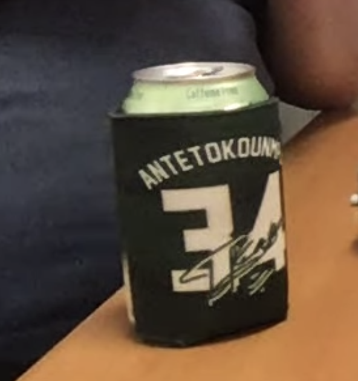

# Legend for docs: cool stuff and how to use them

## Heading 1 is reserved for main headings 

### Heading 2 is reserved for subheadings

#### Heading 3 can be used for points of emphasis, example titles, and short definitions

1. The ordered lists should be used to walk people through instructions
2. Do this
3. now do that
4. and finish with this other thing
5. should be used for setup synopsis, tutorial steps synopsis, etc. 
6. thinking it would be cool to have this at the bottom of some pages as a synopsis of what you had to do previously.



```text
All code, no matter how small or inconsequential it might seem,
needs to go in a code block.
This lets readers know what they're looking at before they read anything


```



```
Please don't do this. Use the tabs and have one codeblock 
w/ only one file in each codeblock. It keeps it way more 
readable and a lot more intuitive. 

```





```text
This is how you will do examples that require changes
to multiple file types.
Notice that with this option you won't have to put a title
in the code block like you did above
you just have to title the tab itself.
Your titles should be example_name.file_type
```











> I'm thinking that we could have quotes from Chris, Zach, and others about their thoughts about certain aspects of Juicebox throughout the docs that will help solidify ideas or give people insights to our thought process.



| Table Types | What field they're good for |  |
| :--- | :--- | :--- |
| Periodic | Scientists |  |
| Dining | Eating, drawing, general multipurpose |  |
| Coffee | Books and other junk. Sometimes coffee. |  |
| Ping Pong | Unwinding |  |
| Pool | Not swimming |  |


The hint fields are for notes of different types. This is general use. Use this if it doesn't fit into the following ones.



This is for common issues and important problems that people may run into.



This would be something that would be neat to use with the ordered checklist above. 



This is for something else. I don't know yet




